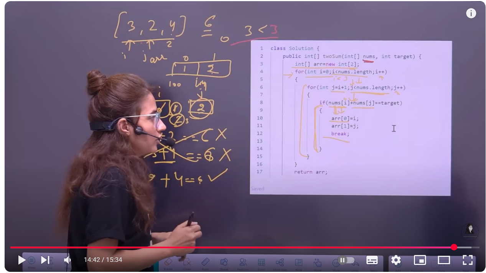
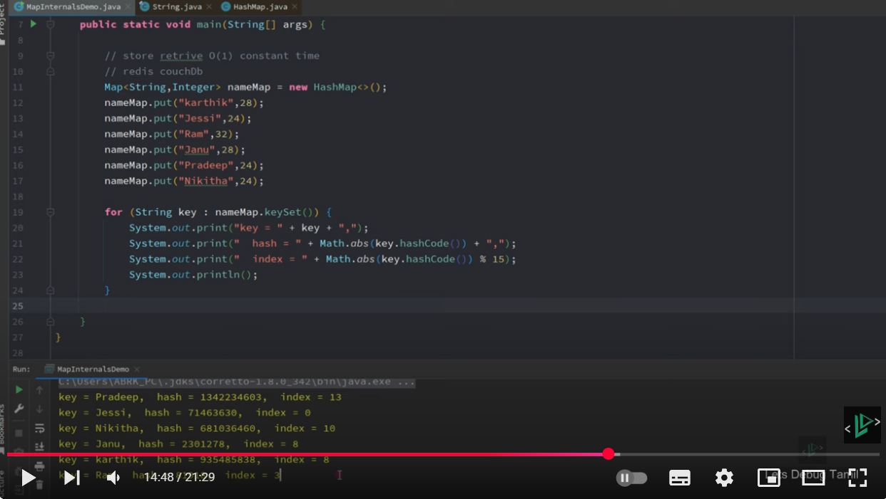
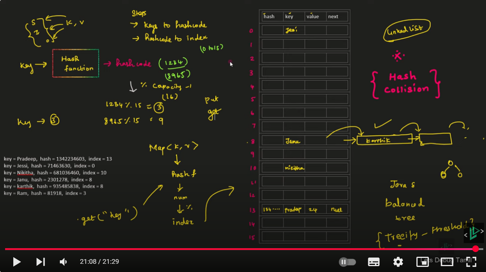

# Two Sum Problem - LeetCode

## Problem Statement
Given an array of integers `nums` and an integer `target`, return indices of the two numbers such that they add up to `target`.

You may assume that each input would have exactly one solution, and you may not use the same element twice.
You can return the answer in any order.

### Examples

**Example 1:**
```
Input: nums = [2,7,11,15], target = 9
Output: [0,1]
Explanation: Because nums[0] + nums[1] == 9, we return [0, 1].
```

**Example 2:**
```
Input: nums = [3,2,4], target = 6
Output: [1,2]
```

**Example 3:**
```
Input: nums = [3,3], target = 6
Output: [0,1]
```

### Constraints
- 2 <= nums.length <= 10^4
- -10^9 <= nums[i] <= 10^9
- -10^9 <= target <= 10^9
- Only one valid answer exists.

## Solution Approaches

### 1. Brute Force Approach
This approach checks every possible pair of numbers in the array.

```java
class Solution {
    public int[] twoSum(int[] nums, int target) {
        int arr[] = new int[2];
        for (int i = 0; i < nums.length; i++) {
            for (int j = i + 1; j < nums.length; j++) {
                if (nums[i] + nums[j] == target) {
                    arr[0] = i;
                    arr[1] = j;
                    break;
                }
            }
        }
        return arr;
    }
}
```

**Time Complexity**: O(n²) - For each element, we search through the rest of the array.
**Space Complexity**: O(1) - Only storing a fixed-size array.


### 2. Optimized Approach Using HashMap
This approach uses a HashMap to store each number and its index. For each element, we check if its complement (target - current number) exists in the HashMap.

```java
import java.util.HashMap;

class Solution {
    public int[] twoSum(int[] nums, int target) {
        HashMap<Integer, Integer> map = new HashMap<>(); // num -> index
        
        for (int i = 0; i < nums.length; i++) {
            int complement = target - nums[i]; // What we need to find
            
            if (map.containsKey(complement)) {
                return new int[] { map.get(complement), i }; // Found the pair
            }
            
            map.put(nums[i], i); // Store the num and its index
        }
        
        // As per constraint, there's always one solution
        throw new IllegalArgumentException("No solution found");
    }
}
```
✅ Step-by-Step Explanation
Let’s take:

java
Copy
Edit
nums = [2,7,11,15], target = 9
🔄 Loop Walkthrough:
Step (i)	nums[i]	complement (target - nums[i])	map before	map after	Found Pair?
0	2	7	{}	{2:0}	❌ No
1	7	2	{2:0}	Return [0,1] ✅	✅ Yes! Found!

✅ At i = 1:
complement = 9 - 7 = 2

map.containsKey(2) ➔ ✅ True

We earlier stored 2 at index 0.

🔥 So this line runs:
java
Copy
Edit
return new int[] { map.get(complement), i };
map.get(2) ➔ returns 0

i ➔ is 1

✔️ So it returns [0, 1] ➔ which is the correct answer.

✅ Deep Meaning of this Return Line
java
Copy
Edit
return new int[] { map.get(complement), i };
📦 "Give me the earlier index where I saw the complement ➕ my current index. That’s my answer!"

✔️ So we return the pair of indices [index_of_complement, current_index].

✅ Why HashMap Makes it Fast (O(n))
HashMap gives O(1) lookup.

So, in one single loop:

We check if complement exists ➔ O(1)

We add current number to map ➔ O(1)

✔️ Overall ➔ O(n) time ➔ fast and efficient!

✅ Visual Diagram of Map Building
text
Copy
Edit
Initial map: {}

i = 0 ➔ nums[0] = 2 ➔ complement = 7
- Map doesn't have 7 ➔ put 2 ➔ map becomes {2:0}

i = 1 ➔ nums[1] = 7 ➔ complement = 2
- Map has 2 ➔ Found pair!
- Return [map.get(2), 1] ➔ [0, 1]
✅ Final Takeaways:
Use HashMap to store ➔ num ➔ index

For each number ➔ check if its complement is already stored.

If found ➔ return the pair of indices immediately.

Time Complexity ➔ O(n) ✅

Space Complexity ➔ O(n) (because we store elements in map)

🎯 DSA Concepts You Practiced Here:
Concept	Used in this Solution?
HashMap	✅ Yes
Complement Logic	✅ Yes
Single-pass loop	✅ Yes
Time O(n), Space O(n)	✅ Yes

**Time Complexity**: O(n) - We only need to iterate through the array once.
**Space Complexity**: O(n) - In the worst case, we might need to store all elements in the HashMap.

## Understanding HashMap in Java




### How HashMap Works Internally in Java

#### Step 1: Core Terminology

| Term | Explanation |
|------|-------------|
| Bucket | HashMap stores data in buckets. Each bucket is a slot in an internal array where multiple items can be stored. |
| Initial Capacity | By default, Java HashMap creates an internal array of 16 buckets. |
| Load Factor | Default value is 0.75. When 75% of the buckets are filled, HashMap doubles its capacity (rehashing happens). |
| Key → hashCode → index | HashMap first computes hashCode() of the key, then compresses it into an array index using (hash & (capacity - 1)). |

#### Step 2: Hashing & Index Calculation

The precise formula in Java for calculating index:
```java
index = (hash & (capacity - 1))
```

For capacity = 16, index is (hash & 15).

This is equivalent to hash % capacity, but faster because it uses bitwise AND (faster than modulo %).

Process flow:
Key → hashCode() → hash function → gets compressed into array index.

If two keys hash to same index → collision occurs.

#### Step 3: Collision Handling

When multiple keys map to the same index → it forms a linked list inside that bucket.

Example: keys 2, 18, 34 may all hash to bucket 2.


#### Step 4: Java 8 Optimization (Linked List → Balanced Tree)

In Java 8, if a bucket's linked list grows too long (threshold = 8 entries),
it converts the linked list into a balanced tree (Red-Black Tree).

Why? Because searching in a long linked list is O(n), but in a balanced tree, it becomes O(log n) — much faster for worst cases.


#### Step 5: Put and Get Operations

Both .put() and .get() first compute the hash and then go to the correct bucket (array index).

Inside the bucket:
- If only one item → direct match.
- If multiple (collision) → it traverses linked list or tree to find the key.

#### Complete Internal Flow of HashMap

```
Key → hashCode() → hash → index (hash & (capacity - 1)) →
  → Go to bucket[index]:
     - If no collision → store node
     - If collision:
         - If entries ≤ 8 → use linked list
         - If entries > 8 → convert to balanced tree (Java 8+)
```

### Practical Example: Using HashMap in Two Sum

Let's trace through our Two Sum solution to see how the HashMap works:

For the input array `[2, 7, 11, 15]` with target `9`:

1. i=0: nums[0]=2
   - complement = 9-2 = 7
   - map is empty, so add {2→0} to map
   - map: {2→0}

2. i=1: nums[1]=7
   - complement = 9-7 = 2
   - map contains 2!
   - return [map.get(2), 1] which is [0, 1]

This demonstrates the efficiency of using HashMap for lookups - we found our answer in just 2 steps!
# ✅ Example: Amazon Gift Card Matching
🎯 User Goal: "I have ₹1000 gift card, show me 2 items whose total is exactly ₹1000"

Behind the scenes:

All product prices ➔ become your nums[]

Gift card amount ➔ is your target

System uses Two Sum logic to check pairs:

java
Copy
Edit
if (price1 + price2 == giftCardAmount) {
    showPair(price1, price2);
}
# ✔️ This is a direct real-world application of Two Sum!


## References

- [Two Sum Problem on LeetCode](https://leetcode.com/problems/two-sum/)
- [Understanding HashMap in Java](https://www.youtube.com/watch?v=zvqCKEeqpFw)
- [Two Sum Problem-jenny](https://youtu.be/x52qXQyzsns?si=86_CkB8O1JKaw9TK)
